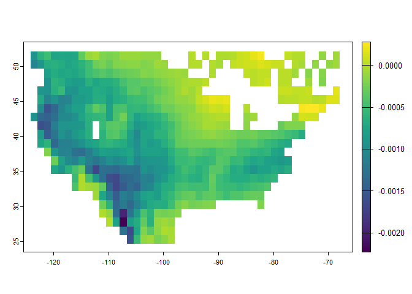
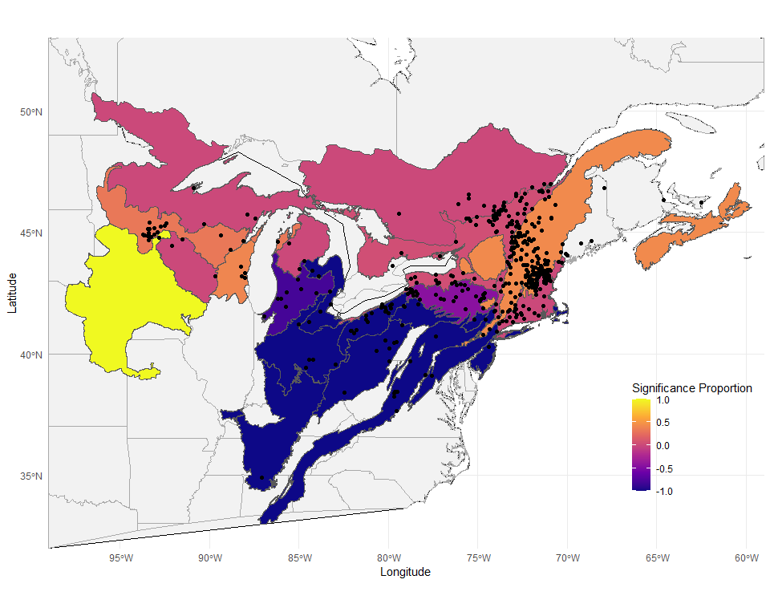
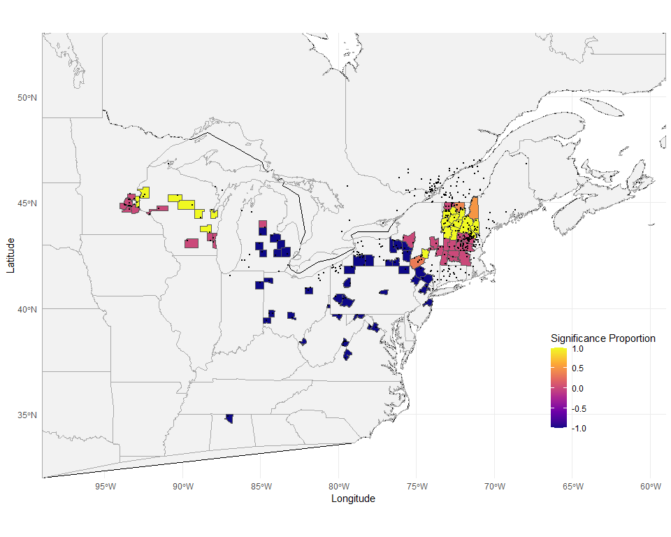

<!-- README.md is generated from README.Rmd. Please edit that file -->

# mapler

<!-- badges: start -->

<!-- badges: end -->

The goal of mapler is to provide functions to investigate how maple
syrup production could be impacted by climate change.

## Installation

You can install the development version of mapler from
[GitHub](https://github.com/) with:

``` r
# install.packages("pak")
pak::pak("matthewwhite1/mapler")
```

## Downloading Climate Data

This package provides three functions for downloading climate data:
`download_ghcnd()`, `download_loca2()`, and `download_prism()`. These
functions are useful for downloading both historic climate data and
future climate projections.

Once data is downloaded, it can be loaded into R using `loca_t_rast()`
or `prism_t_rast()`, “t” meaning temperature. These functions take
filepaths of where the data is downloaded and return the tmin and tmax
raster stacks.

## Calculating Sap Days

Maple sap tapping is highly dependent on the freeze/thaw cycle. This
package calls a “sap day” a day where the temperature switched between
freezing and thawing during the day.

The function `sap_day()` takes in tmin and tmax raster stacks and
aggregates them into a yearly sap day stack. This combination of tmin
and tmax is used to calculate the proportion of sap days in a year at
every pixel. This function can be used for future climate projection
with LOCA2 data.

## Package Data

This package contains a few datasets from various sources. The `farms`
datasets (`us_farms`, `canada_farms`, `quebec_farms`) contain maple farm
names and addresses scraped from the internet. The `farms_coords`
dataset contains geocoded latitude and longitude coordinates of these
farms.

This package also contains two datasets to assist in downloading climate
data: `loca2_model_names` and `ghcnd_stations`.

For an example of what `sap_day()` can do, this package contains an
example raster called `test_loca_sap_day`. This was created by
downloading historical and scenario ssp585 tmin and tmax data from the
LOCA2 model ACCESS-CM2, loading the rasters into R using
`loca_t_rast()`, calculating yearly sap day proportions using
`sap_day()`, shifting the longitude by -360 to match WGS84, and
aggregating by a factor of 20 to decrease the file size. It can be
accessed like so:

``` r
test_loca_file <- system.file("extdata", "test_loca_sap_day.tif",
                                package = "mapler")
sap_prop <- terra::rast(test_loca_file)
```

## Sen’s Slope

This package contains a function called `sens_slope_rast()` that
calculates the Sen’s slope for every pixel in a raster stack. This
function is based on the Rcpp-optimized `sens_slope()` function, which
can be used in contexts separate from maple syrup. These functions can
be used like so:

``` r
library(mapler)
library(terra)
#> terra 1.8.60

# Get Sen's slope of vector of random values
x <- rnorm(1000)
sens_slope(x)
#> $estimates
#>  Sen's slope 
#> 4.535156e-05 
#> 
#> $statistic
#>         z 
#> 0.4158761 
#> 
#> $p.value
#> [1] 0.6775007
#> 
#> $parameter
#>    n 
#> 1000 
#> 
#> $conf.int
#> [1] -0.0001676862  0.0002620045
#> attr(,"conf.level")
#> [1] 0.95

# Get and plot Sen's slope of entire raster
test_loca_file <- system.file("extdata", "test_loca_sap_day.tif",
                                package = "mapler")
sap_prop <- terra::rast(test_loca_file)
sens_rast <- sens_slope_rast(sap_prop)
plot(sens_rast[[1]])
```



## Future Climate Projection

The `sens` family of functions can be used for future climate
projection. Output from `sap_day()` can be passed into `sens_farms()`,
along with farms coordinates. This function combines the
`get_sens_farms()` and `get_sens_joined()` functions. `sens_farms()`
starts by calculating the Sen’s slope for each farm and creating a new
variable that is 1 if the slope is significant positive, -1 if the slope
is significant negative, and 0 otherwise. Then, the farms are joined to
a shapefile, and a proportion of the significant variable is calculated
for each group in the shapefile. This resulting dataframe can be plotted
with something like ggplot.

The following code can be used as a guide for plotting a future sap day
projection.

``` r
library(rnaturalearth)
library(rnaturalearthdata)
library(sf)
library(tidyverse)

# Read in farm coordinates and sap day projection
farms_sf <- st_as_sf(farms_coords, coords = c("long", "lat"), crs = 4326)
test_loca_file <- system.file("extdata", "test_loca_sap_day.tif",
                                package = "mapler")
sap_prop <- terra::rast(test_loca_file)

# Read in eco regions shape file
shapefile <- read_sf("Data_Clean/NA_Eco_Level3/NA_CEC_Eco_Level3.shp")
variable <- names(shapefile)[2]

# Get proportion of Sen's significance at each eco region
eco_regions_joined <- sens_farms(farms_coords = farms_sf, sap_prop = sap_prop,
                                 shapefile = shapefile, group_var = variable)

# Prepare map for plotting
crop_lims <- c(xmin = -99, ymin = 32, xmax = -59, ymax = 53)
world <- ne_countries(scale = "medium", returnclass = "sf")
north_america <- world %>%
  filter(region_un == "Americas", name %in% c("United States of America", "Canada")) |>
  st_crop(crop_lims)
us_states <- ne_states(country = "United States of America", returnclass = "sf") |>
  st_crop(crop_lims)
canada_provinces <- ne_states(country = "Canada", returnclass = "sf") |>
  st_crop(crop_lims)

# Plot eco regions colored by significance proportion
ggplot() +
  geom_sf(data = north_america, fill = "grey95", color = "black", size = 0.2) +
  geom_sf(data = us_states, fill = NA, color = "darkgray", size = 0.3) +
  geom_sf(data = canada_provinces, fill = NA, color = "darkgray", size = 0.3) +
  geom_sf(data = eco_regions_joined, mapping = aes(fill = sig_mean)) +
  geom_sf(data = farms_sf, color = "black", size = 1.5) +
  coord_sf(xlim = c(-99, -59), ylim = c(32, 53), expand = FALSE) +
  scale_fill_viridis_c(name = "Significance Proportion", option = "plasma") +
  theme_minimal() +
  labs(
    # title = "Significance of Sens Slope at Maple Farms",
    x = "Longitude",
    y = "Latitude"
  ) +
  theme(legend.position = "inside",
        legend.position.inside = c(0.9, 0.22))
```



The same thing can be done for U.S. counties:

``` r
library(tigris)

shapefile <- counties(cb = TRUE, year = 2020)
#>   |                                                                              |                                                                      |   0%  |                                                                              |                                                                      |   1%  |                                                                              |=                                                                     |   1%  |                                                                              |=                                                                     |   2%  |                                                                              |==                                                                    |   2%  |                                                                              |==                                                                    |   3%  |                                                                              |==                                                                    |   4%  |                                                                              |===                                                                   |   4%  |                                                                              |===                                                                   |   5%  |                                                                              |====                                                                  |   5%  |                                                                              |====                                                                  |   6%  |                                                                              |=====                                                                 |   6%  |                                                                              |=====                                                                 |   7%  |                                                                              |=====                                                                 |   8%  |                                                                              |======                                                                |   8%  |                                                                              |======                                                                |   9%  |                                                                              |=======                                                               |   9%  |                                                                              |=======                                                               |  10%  |                                                                              |=======                                                               |  11%  |                                                                              |========                                                              |  11%  |                                                                              |========                                                              |  12%  |                                                                              |=========                                                             |  12%  |                                                                              |=========                                                             |  13%  |                                                                              |=========                                                             |  14%  |                                                                              |==========                                                            |  14%  |                                                                              |==========                                                            |  15%  |                                                                              |===========                                                           |  15%  |                                                                              |===========                                                           |  16%  |                                                                              |============                                                          |  17%  |                                                                              |============                                                          |  18%  |                                                                              |=============                                                         |  18%  |                                                                              |=============                                                         |  19%  |                                                                              |==============                                                        |  19%  |                                                                              |==============                                                        |  20%  |                                                                              |==============                                                        |  21%  |                                                                              |===============                                                       |  21%  |                                                                              |===============                                                       |  22%  |                                                                              |================                                                      |  22%  |                                                                              |================                                                      |  23%  |                                                                              |================                                                      |  24%  |                                                                              |=================                                                     |  24%  |                                                                              |=================                                                     |  25%  |                                                                              |==================                                                    |  25%  |                                                                              |==================                                                    |  26%  |                                                                              |===================                                                   |  27%  |                                                                              |===================                                                   |  28%  |                                                                              |====================                                                  |  28%  |                                                                              |====================                                                  |  29%  |                                                                              |=====================                                                 |  29%  |                                                                              |=====================                                                 |  30%  |                                                                              |=====================                                                 |  31%  |                                                                              |======================                                                |  31%  |                                                                              |======================                                                |  32%  |                                                                              |=======================                                               |  32%  |                                                                              |=======================                                               |  33%  |                                                                              |=======================                                               |  34%  |                                                                              |========================                                              |  34%  |                                                                              |========================                                              |  35%  |                                                                              |=========================                                             |  35%  |                                                                              |=========================                                             |  36%  |                                                                              |==========================                                            |  36%  |                                                                              |==========================                                            |  37%  |                                                                              |==========================                                            |  38%  |                                                                              |===========================                                           |  38%  |                                                                              |===========================                                           |  39%  |                                                                              |============================                                          |  39%  |                                                                              |============================                                          |  40%  |                                                                              |============================                                          |  41%  |                                                                              |=============================                                         |  41%  |                                                                              |=============================                                         |  42%  |                                                                              |==============================                                        |  42%  |                                                                              |==============================                                        |  43%  |                                                                              |===============================                                       |  44%  |                                                                              |===============================                                       |  45%  |                                                                              |================================                                      |  45%  |                                                                              |================================                                      |  46%  |                                                                              |=================================                                     |  46%  |                                                                              |=================================                                     |  47%  |                                                                              |=================================                                     |  48%  |                                                                              |==================================                                    |  48%  |                                                                              |==================================                                    |  49%  |                                                                              |===================================                                   |  49%  |                                                                              |===================================                                   |  50%  |                                                                              |===================================                                   |  51%  |                                                                              |====================================                                  |  51%  |                                                                              |====================================                                  |  52%  |                                                                              |=====================================                                 |  52%  |                                                                              |=====================================                                 |  53%  |                                                                              |======================================                                |  54%  |                                                                              |======================================                                |  55%  |                                                                              |=======================================                               |  55%  |                                                                              |=======================================                               |  56%  |                                                                              |========================================                              |  56%  |                                                                              |========================================                              |  57%  |                                                                              |========================================                              |  58%  |                                                                              |=========================================                             |  58%  |                                                                              |=========================================                             |  59%  |                                                                              |==========================================                            |  59%  |                                                                              |==========================================                            |  60%  |                                                                              |==========================================                            |  61%  |                                                                              |===========================================                           |  61%  |                                                                              |===========================================                           |  62%  |                                                                              |============================================                          |  62%  |                                                                              |============================================                          |  63%  |                                                                              |=============================================                         |  64%  |                                                                              |=============================================                         |  65%  |                                                                              |==============================================                        |  65%  |                                                                              |==============================================                        |  66%  |                                                                              |===============================================                       |  66%  |                                                                              |===============================================                       |  67%  |                                                                              |===============================================                       |  68%  |                                                                              |================================================                      |  68%  |                                                                              |================================================                      |  69%  |                                                                              |=================================================                     |  69%  |                                                                              |=================================================                     |  70%  |                                                                              |=================================================                     |  71%  |                                                                              |==================================================                    |  71%  |                                                                              |==================================================                    |  72%  |                                                                              |===================================================                   |  72%  |                                                                              |===================================================                   |  73%  |                                                                              |===================================================                   |  74%  |                                                                              |====================================================                  |  74%  |                                                                              |====================================================                  |  75%  |                                                                              |=====================================================                 |  75%  |                                                                              |=====================================================                 |  76%  |                                                                              |======================================================                |  77%  |                                                                              |======================================================                |  78%  |                                                                              |=======================================================               |  78%  |                                                                              |=======================================================               |  79%  |                                                                              |========================================================              |  79%  |                                                                              |========================================================              |  80%  |                                                                              |========================================================              |  81%  |                                                                              |=========================================================             |  81%  |                                                                              |=========================================================             |  82%  |                                                                              |==========================================================            |  82%  |                                                                              |==========================================================            |  83%  |                                                                              |==========================================================            |  84%  |                                                                              |===========================================================           |  84%  |                                                                              |===========================================================           |  85%  |                                                                              |============================================================          |  85%  |                                                                              |============================================================          |  86%  |                                                                              |=============================================================         |  87%  |                                                                              |=============================================================         |  88%  |                                                                              |==============================================================        |  88%  |                                                                              |==============================================================        |  89%  |                                                                              |===============================================================       |  89%  |                                                                              |===============================================================       |  90%  |                                                                              |===============================================================       |  91%  |                                                                              |================================================================      |  91%  |                                                                              |================================================================      |  92%  |                                                                              |=================================================================     |  92%  |                                                                              |=================================================================     |  93%  |                                                                              |=================================================================     |  94%  |                                                                              |==================================================================    |  94%  |                                                                              |==================================================================    |  95%  |                                                                              |===================================================================   |  95%  |                                                                              |===================================================================   |  96%  |                                                                              |====================================================================  |  97%  |                                                                              |====================================================================  |  98%  |                                                                              |===================================================================== |  98%  |                                                                              |===================================================================== |  99%  |                                                                              |======================================================================|  99%  |                                                                              |======================================================================| 100%
variable <- "GEOID"

us_counties_joined <- sens_farms(farms_coords = farms_sf, sap_prop = sap_prop,
                                 shapefile = shapefile, group_var = variable)

# Plot
ggplot() +
  geom_sf(data = north_america, fill = "grey95", color = "black", size = 0.2) +
  geom_sf(data = us_states, fill = NA, color = "darkgray", size = 0.3) +
  geom_sf(data = canada_provinces, fill = NA, color = "darkgray", size = 0.3) +
  geom_sf(data = us_counties_joined, mapping = aes(fill = sig_mean)) +
  geom_sf(data = farms_sf, color = "black", size = 0.5) +
  coord_sf(xlim = c(-99, -59), ylim = c(32, 53), expand = FALSE) +
  scale_fill_viridis_c(name = "Significance Proportion", option = "plasma") +
  theme_minimal() +
  labs(
    # title = "Significance of Sens Slope at Maple Farms",
    x = "Longitude",
    y = "Latitude"
  ) +
  theme(legend.position = "inside",
        legend.position.inside = c(0.9, 0.22))
```


